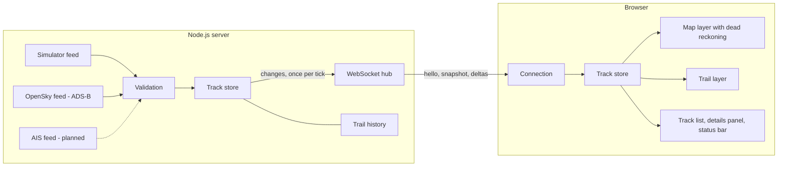

# Watchfloor

A real-time **common operating picture (COP)**: live air and sea tracks on a tactical map, drawn with NATO-standard MIL-STD-2525 symbols.


By default Watchfloor runs on a built-in traffic simulator over the English Channel, so it works offline. It can also show live aircraft from the [OpenSky Network](https://opensky-network.org), on their own or alongside the simulation. Every feed plugs into the same pipeline, so nothing downstream knows or cares where a track came from.

## What it does

- Shows real aircraft from the OpenSky Network, polled within its free daily credit budget, filled in from a second network (adsb.lol) where you're zoomed in, or simulated traffic, and always says which
- Streams a live picture to the browser over WebSockets, sending only what changed each second
- Draws each contact with its MIL-STD-2525C symbol, callsign label and a speed leader showing where it's heading, or as a small identity-coloured dot when zoomed out to a continent or the world
- Moves symbols smoothly between reports using dead reckoning, so tracks glide instead of jumping
- Fades tracks that stop reporting, then removes them after a timeout that depends on the track type and how often its source reports, and says in the status bar when a live feed is rate limited or not responding
- Shows where each track has been with a history trail, for all tracks, only the selected one, or none
- Lists every track, all 7,000+ of them worldwide, in a sortable table you can filter by air or sea and search by callsign; selecting a row selects the track on the map, and the other way round
- Lets you select a track to see its position, course, speed, altitude and report age, and follow it across the map
- Survives network trouble: automatic reconnect with backoff, a heartbeat watchdog, and resync for slow clients
- Simulates about 85 contacts: airliners on airways, a maritime patrol racetrack, an unidentified drone, merchant ships in the real Dover Strait shipping lanes, cross-channel ferries, fishing and leisure boats

## Quick start

Requires Node.js 20.12 or newer.

```bash
npm install
npm run dev
```

Open http://localhost:5173. The server runs on port 8080 and Vite proxies the WebSocket to it.

For production, as a single process on one port:

```bash
npm run build
npm start          # http://127.0.0.1:8080
```

Other commands:

| Command | What it does |
| --- | --- |
| `npm test` | Unit tests (Vitest) |
| `npm run typecheck` | Strict TypeScript checks across all packages |

Keyboard shortcuts:

| Key | Action |
| --- | --- |
| `L` | Open or close the track list |
| `/` | Search the track list |
| `↑` `↓` `Enter` | Move through the list and select a track |
| `T` | Cycle trails: all tracks, selected only, off |
| `Esc` | Clear the selection |

Settings live in `.env` (copy `.env.example`). For example, `SIM_SEED` makes the simulated traffic identical every run, and `VITE_MAP_STYLE_URL=offline` runs without basemap tiles.

### Live aircraft

Add `adsblol` to `FEEDS` (for example `FEEDS=opensky,adsblol`) to fill in aircraft OpenSky's receivers miss from a second volunteer network, adsb.lol. It's free and needs no key, but it only answers "aircraft within 250 nm of a point", so it covers views up to about a region (roughly zoom 6 and closer) and stands aside when you zoom out further. In a side-by-side test over five African areas it added only a handful of aircraft: both networks rely on ground receivers, and both saw nothing around Lagos or Addis Ababa. Only satellite ADS-B fills those gaps, and that's enterprise-priced.

Set `FEEDS=opensky` in `.env` for real aircraft over the scenario's area, or `FEEDS=sim,opensky` for both. Add `OPENSKY_AREA=world` for every aircraft OpenSky can see, about 7,000 at once, or `OPENSKY_AREA=viewport` for anywhere in the world but only what's on screen, which is much cheaper when zoomed in. The top bar says whether the picture is live, simulated or both.

No account is needed. OpenSky gives anonymous users 400 credits a day, and one poll of the English Channel box costs 1 credit, so the default interval is a budget decision:

| Access | Credits a day | Default poll | Live data lasts |
| --- | --- | --- | --- |
| Anonymous | 400 | 60 s | about 6.7 hours a day |
| Free account (`OPENSKY_CLIENT_ID`, `OPENSKY_CLIENT_SECRET`) | 4,000 | 15 s | about 16.7 hours a day |

Those figures are for the Channel box. A worldwide poll costs 4 credits, so anonymous access gives about 1.7 hours of viewing a day at 60 s, and a free account about 16.7 hours at 60 s. Viewport mode costs 1 credit a poll zoomed in to a region (zoom 8 or closer), 2 for a country-sized view, and 4 zoomed out to the world, so it stretches the same allowance up to four times further. For worldwide use, an account is the practical choice.

Polling pauses while no browser is connected, so credits are only spent while someone is watching; a page reload doesn't pause it or trigger an extra poll. Change the interval with `OPENSKY_POLL_S`. When the credits run out, OpenSky returns 429 with the time to wait; Watchfloor waits exactly that long, the status bar says when polling resumes, the tracks fade and drop, and polling resumes by itself. `/healthz` shows credits remaining and the last error. To rehearse failures without spending credits, point `OPENSKY_API_URL` at a local stub.

## Architecture


```mermaid
flowchart LR
  subgraph Server [Node.js server]
    SIM[Simulator feed] --> SINK
    ADSB[OpenSky feed - ADS-B] --> SINK
    AIS[AIS feed - planned] -.-> SINK
    SINK[Validation] --> STORE[Track store]
    STORE -->|changes, once per tick| HUB[WebSocket hub]
    STORE --- HIST[Trail history]
  end
  HUB -->|hello, snapshot, deltas| CLIENT
  subgraph Browser
    CLIENT[Connection] --> CSTORE[Track store]
    CSTORE --> LAYER[Map layer with dead reckoning]
    CSTORE --> TRAILS[Trail layer]
    CSTORE --> PANEL[Track list, details panel, status bar]
  end
```

The project is an npm workspace with three packages:

```
shared/   Track type, message protocol, geodesy, input validation (used by both sides)
server/   Feeds, track store, WebSocket hub, static hosting
client/   MapLibre map, symbology, UI
```

### Design decisions

**One track shape everywhere.** Every feed translates its data into the `Track` type in `shared/src/track.ts`. The server, protocol and UI never know where a track came from, which is what makes adding a new feed a contained change.

**Validate at the edge.** All reports pass through `sanitizeTrack` before entering the store. It rejects data that can't be trusted (NaN positions, out-of-range coordinates, timestamps from the future) and repairs what it can, such as headings of 365°.

**Batch updates, don't stream every report.** Feeds may report hundreds of times a second. The store records which tracks changed, and once per tick the hub sends a single delta containing only their latest state. The payload is serialised once and shared by every client.

**Idempotent protocol.** A client gets `hello`, then a full `snapshot`, then a `delta` every tick. Applying a delta twice, or removing a track the client never had, is harmless, so reconnecting needs no special handling. The protocol is versioned, and an out-of-date page tells the user to reload instead of misreading messages.

**Trail history lives on the server too.** Deltas carry only each track's latest state, and a browser that has just connected has seen nothing yet. So the server records every accepted report into a short per-track history (5 minutes for aircraft, 30 for ships) and includes it in the snapshot. A reloaded page shows full trails straight away. After that, the browser extends trails from each delta. Both sides use the same `TrailHistory` class from `shared/`, so they skip near-duplicate points and expire old ones identically. Trails show only *reported* positions, never estimated ones, so they never claim the track was somewhere it wasn't seen.

**Redraw only what changes.** Trails change only when a report arrives, so they're rebuilt about once a second. The short segment joining the last report to the moving symbol changes every frame, so it lives in its own small source. The 10 Hz work stays at one segment per track however long the trails get.

**Scale to the whole world by not doing work nobody can see.** Worldwide there are 7,000+ aircraft, against the simulator's 85. Four measures keep the browser smooth, each tested and measured in headless Chrome:

- *Redraw only as often as anything can visibly move.* At zoom 2 a pixel is about 20 km, so a jet takes over a minute to cross one. The render interval comes from the zoom: often enough that a 300 m/s jet moves at most half a pixel per frame, between 10 Hz (zoomed in) and 1 Hz (world view).
- *Draw only what's near the screen.* Every track is still dead-reckoned, but only those in the view plus a margin become map features. Zoomed in, that cut main-thread work from 1,450 to 208 ms per 3 seconds.
- *Dots below zoom 5.* Thousands of overlapping symbols read as a smear, so a circle layer coloured by identity takes over, and speed leaders aren't computed at all.
- *A windowed track list.* Only the rows in view exist (34 of 6,934 in testing), with spacer rows giving the scrollbar its full height. Screen readers still get the real size and position through `aria-rowcount` and `aria-rowindex`.

**Backpressure measured in ticks, not bytes.** The hub pauses clients that fall behind and later resyncs them with a snapshot. It used to judge "behind" by bytes buffered, and a worldwide snapshot is 2.5 MB on its own, so every new client looked slow, got another snapshot, and looked slow again: 29 snapshots in 1.5 seconds in a test. Now the hub counts deltas not yet written. Deltas waiting behind a snapshot don't count, so a resync can never start while a snapshot is still being sent.

**A list that doesn't fight the operator.** The track list updates every second, but its rows are kept per track and only moved when the order actually changes. Scroll position, hover and keyboard focus survive the updates. Sorting puts missing values (a ship's altitude, an unknown callsign) last in either direction, and breaks ties on track id so equal rows don't swap places every second. The filtering and sorting are pure functions with their own tests.

**Source time, not receive time.** Every report is stamped with when the source observed the position, not when we received it. It matters with live data: in testing, OpenSky was still listing a low-flying medical helicopter whose last position was five and a half minutes old. Stamped with receive time it would have looked live and been dead-reckoned from a stale fix; stamped with OpenSky's position time it correctly fades and drops.

**Staleness sized to the source.** Aircraft transponders report every second or so, so the default is to fade an aircraft after 30 s of silence. A polled feed is different: OpenSky data arrives in bursts every 10 to 60 seconds and is already up to 25 s old when it lands. So staleness rules can be overridden per source, and the OpenSky rule is derived from the poll interval: fade after two missed polls (one slow poll shouldn't fade the whole sky) and drop after about six. Server and client look rules up through one function, so they can't disagree.

**Live data on a budget, failing gracefully.** OpenSky's free tier is a daily credit allowance, so the poll interval is set by how long the credits should last, and retries never go faster than the normal interval. A 429 means waiting exactly as long as OpenSky says; network errors and 5xx responses back off exponentially with jitter. Failures never throw out of the feed: they just stop new reports, and the picture degrades visibly through the normal staleness rules instead of freezing. The feed takes `fetch`, the clock and timers as parameters, so tests replay recorded OpenSky responses and script 429s without touching the network.

**Spend credits only on an audience.** The hub reports how many browsers are connected, and feeds get an optional "is anyone watching?" hint. The simulator ignores it; the OpenSky feed skips its next due poll when the room is empty. Because it pauses at the next due poll rather than at once, the pending timer acts as a grace period and a page reload never pauses it. Resuming polls at the time already scheduled, never sooner, so ten quick reloads can't spend ten credits and a 429 wait still holds. The server also starts paused, so development restarts don't spend credits either.

**Poll what people are looking at.** In viewport mode each browser tells the server what's on screen, and the server asks OpenSky for just that. A pure planner turns views into the cheapest requests: it splits views that cross the antimeridian (OpenSky can't take those), rounds outward to whole degrees so small pans don't change the request, and chooses between separate small boxes, one box around them all, or the whole world. Panning somewhere new brings the next poll forward, debounced so a multi-step zoom costs one poll, and never within 10 seconds of the last one or into a rate-limit wait (3 seconds for adsb.lol, which is free). Browser messages are untrusted input, because they decide what a paid API is asked for: they're strictly parsed, size-capped at 4 KB, and coalesced to one report per tick. In testing, opening on the Channel cost 2 credits a poll instead of the world's 4.

**Several providers, one aircraft, one track.** OpenSky and adsb.lol both report aircraft by their ICAO transponder address, and both feeds use it as the track id (`adsb:4ca7b3`), so a plane both networks see is one track, not two. The store already keeps only the newest report per track; the new rule is that a newer report can't erase identity: a known callsign stays if the newer report lacks one, and a generic "aircraft" never replaces a specific "airliner", so symbols don't flicker between providers. Position, speed and altitude always come from the newest report. Both providers' ADS-B categories go through one shared table, the details panel names who delivered the latest report ("ADS-B via adsb.lol"), and the map credits each provider, with adsb.lol's ODbL licence. The polling schedule (pausing with no viewers, debounced early polls) lives in one shared `PollScheduler`, so the second feed reused it instead of copying subtle code.

**Measure the wait, then cut the biggest part.** Panning used to take 6 to 8 seconds to show new aircraft. Timing each step showed where it went: the browser and server each waited for the view to settle, the server only read views once a second, and adsb.lol's circles were fetched one after another although each takes 1 to 3.5 seconds to answer. Views are now reported within 100 ms, the free provider settles faster, and its circles are fetched two at a time with each pushed as it lands. Measured in headless Chrome, a pan now shows new aircraft in about 3 seconds; most of what's left is adsb.lol's own response time. When the map is empty only because the view is too wide for adsb.lol and nothing else is delivering, the status bar says to zoom in.

**Say what's real.** The server tells the browser whether the picture is live, simulated or both, and the top bar says so. A simulated contact must never be mistaken for a real one. Likewise, when a live feed is rate limited or down, the status bar says so ("OpenSky rate limited, resumes 270000Z") instead of letting aircraft fade without explanation; a healthy feed says nothing. Feed status rides on the next delta only when it changes, so the per-second message stays small.

**Server time, not browser time.** Track ages and dead reckoning compare server timestamps with "now". The client estimates its clock offset from every message, so a browser clock that's a few seconds off doesn't make tracks look stale.

**Deterministic simulation.** The simulator uses a seeded random number generator and an injectable clock, so tests can run an hour of traffic in milliseconds and get the same result every time. Ships only move along defined lanes, routes and areas, which keeps them at sea without coastline data. Aircraft and ships have realistic turn rates, acceleration and report intervals, and transponders occasionally go quiet.

## Roadmap

- [x] Simulator, WebSocket pipeline, symbology, selection and details
- [x] Track history trails and a sortable, filterable track list
- [x] Live aircraft from the OpenSky Network API, filled in from adsb.lol
- [ ] Live ships from AISStream.io
- [ ] Geofences with entry and exit alerts
- [ ] Operator tagging of affiliation (friend, neutral, unknown and so on)
- [ ] Recording and a replay timeline

## Data and credits

- Basemap: © OpenStreetMap contributors, © CARTO
- Symbols: [milsymbol](https://github.com/spatialillusions/milsymbol)
- Map rendering: [MapLibre GL JS](https://maplibre.org/)
- Live aircraft: [The OpenSky Network](https://opensky-network.org) and [adsb.lol](https://adsb.lol) (data under the [ODbL](https://opendatacommons.org/licenses/odbl/))

All simulated traffic is invented, including callsigns and vessel names. Live aircraft come from crowd-sourced receivers (OpenSky, adsb.lol) and can be delayed, incomplete or missing; empty areas often mean no receivers, not no aircraft. This is a portfolio project and must not be used for navigation.
